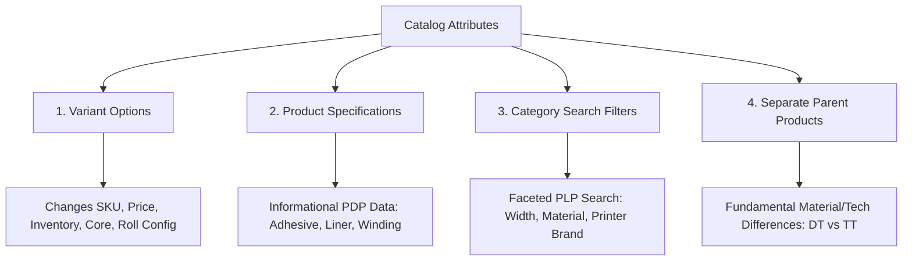

# BIS LABELS — BIGCOMMERCE CATALOG ARCHITECTURE & PDP FUTURE PLANNING ANALYSIS
`BIS_LABELS_CATALOG_ARCHITECTURE_ANALYSIS.md`

> **Document Type:** Architectural Blueprint & Catalog Strategy Analysis  
> **Target Platform:** BigCommerce Enterprise (Stencil Framework / Flexcart 4.9.1 Base)  
> **Storefront:** BIS Labels (`https://www.bislabels.com`)  
> **Status:** Planning & Analysis Only (Zero Code or Catalog Modifications Applied)  
> **Author:** Senior Ecommerce Architect & BigCommerce Catalog Strategist  
> **Date:** August 25, 2026

---

## Executive Summary

This document provides a comprehensive architectural analysis and strategic blueprint for transitioning BIS Labels from a **fragmented single-SKU catalog model** to a **unified parent-variant catalog architecture** on BigCommerce Enterprise.

Currently, every label size, core dimension, and packaging configuration exists as a standalone product record (Model B). While recent frontend PDP redesign work has significantly elevated visual presentation, purchase UX, Quick Specs, and trust messaging, product discovery remains constrained by catalog fragmentation. 

This analysis defines the future catalog hierarchy, attribute taxonomy, BigCommerce platform constraint management, faceted category search architecture, and a 6-phase migration roadmap.

---

## 1. Current PDP Experience Assessment

### Architectural Baseline
The current BIS Labels Product Detail Page (PDP) combines:
1. **Native BigCommerce Commerce Engine:** Inventory tracking, price calculation, customer group pricing, cart API (`/cart.php`), wishlist, and schema microdata.
2. **BIS Labels Custom UX/Presentation Layer (`.productView.bis-pdp`):**
   - **2-Column Responsive Layout:** 46%/54% media-to-purchase grid split.
   - **Gallery Card:** Technical dimension drawing enclosed in a clean bordered container with an active `SALE` badge.
   - **Header & Subtitle Hierarchy:** Bold uppercase product title + brand tagline (`"Reliable. Durable. Built for High-Volume Printing."`).
   - **Price & Savings Presentation:** Active unit price (`$52.95 / CASE`), strikethrough MSRP (`$69.44`), and savings pill (`SAVE $16.49`).
   - **Quick Specs Bar:** Top horizontal bar highlighting 4 primary physical attributes derived from `product.custom_fields`.
   - **Purchase Form & Controls:** Custom quantity stepper (`- 1 +`), high-contrast red `ADD TO CART` CTA, and direct phone consultation CTA (`tel:+15137725252`).
   - **Trust Reassurance Strip:** 4-column reassurance section (`Fast Shipping`, `Expert Support`, `High-Volume Fulfillment`, `30+ Years Experience`).
   - **Product Specifications Grid:** 4-column card grid rendering 8 structured custom fields.
   - **"Other Sizes & Variations" Section:** Currently implemented as a related-product list fallback due to catalog constraints.

### Assessment of Current "Other Sizes & Variations" Area
- **Current Role:** Operates as a temporary frontend navigation bridge displaying adjacent products in the same category.
- **Limitation:** Because standalone products lack native BigCommerce variant option sets (`product.options` is empty), selecting another size requires a full HTTP page navigation to a different URL.
- **Future Goal:** Transform this area from a related-product list into a **native PDP Variant Configuration Selector** once products are consolidated into parent-child structures.

---

## 2. Current Catalog Challenges (Model B Analysis)

Under the current **Model B (Separate Standalone Products)** architecture:

```text
Category: Direct Thermal Labels
├── Product 1: 4x6 Direct Thermal Label - 1" Core (250/roll)
├── Product 2: 4x6 Direct Thermal Label - 3" Core (1000/roll)
├── Product 3: 4x6 Direct Thermal Label - 3" Core (1500/roll, 8" O.D.)
└── Product 4: 4x6 Direct Thermal Label - 0.75" Core (105/roll)
```

### Operational & Business Challenges
1. **Catalog Bloat & Search Fragmentation:** Category listing pages (PLPs) and storefront search results are flooded with near-identical product cards differing only by core size or roll count.
2. **High Customer Friction:** Buyers looking for a standard 4" x 6" label must click through multiple search results or category pages to find the exact core size required for their printer model.
3. **SEO Keyword Cannibalization:** Dozens of standalone product URLs compete for identical primary search terms (e.g. *"4x6 thermal transfer labels"*), diluting domain authority and page rank.
4. **Merchandising Overhead:** Updating marketing copy, technical specification sheets, compatibility guides, or imagery requires updating hundreds of individual product records via CSV imports rather than editing a single parent product.

---

## 3. Recommended Product Hierarchy

To streamline discovery and establish an enterprise catalog structure, BIS Labels should adopt a **3-Tier Parent-Variant Hierarchy**:

```text
Tier 1: Category (e.g., Thermal Labels)
└── Tier 2: Sub-Category / Technology (e.g., Direct Thermal Labels)
    └── Tier 3: Parent Product (e.g., 4" x 6" Direct Thermal Labels — Standard Paper)
        ├── Variant 1: 0.75" Core | 105 Labels/Roll (36 Rolls/Case) [SKU: DT46-075-105]
        ├── Variant 2: 1.00" Core | 250 Labels/Roll (12 Rolls/Case) [SKU: DT46-100-250]
        └── Variant 3: 3.00" Core | 1,000 Labels/Roll (4 Rolls/Case) [SKU: DT46-300-1000]
```

### Core Rules for Product Consolidation
1. **Parent Product Definition:** A Parent Product represents a specific **Label Dimension (Width x Height) + Print Technology + Material/Adhesive Grade** (e.g., `4" x 6" Direct Thermal Standard Paper Labels`).
2. **Variant Definition:** Variants represent **real, manufactured, purchasable SKUs** representing specific Core Sizes and Packaging Configurations.
3. **Strict Non-Combinatorial Rule:** **DO NOT** generate mathematically possible variant combinations in BigCommerce if the SKU does not exist in the warehouse. Only create variant options for real, inventory-backed SKUs.
4. **Preservation of Variant Data:** Every variant must maintain its distinct:
   - Unique SKU
   - Variant Price / Case Price
   - Stock & Inventory Level
   - Weight & Dimensions for Shipping
   - Specific Barcode / UPC (if applicable)

---

## 4. Variant Strategy Analysis (Option Comparison)

Selecting the right variant option model is critical for usability and BigCommerce system stability.

### Option A: Multi-Dropdown Architecture (Technical Attributes)
*Structure:* 4 separate option dropdowns (`Core Size` + `Outer Diameter` + `Labels Per Roll` + `Case Configuration`).

```text
[ Core Size: 3" ] ➔ [ Outer Diameter: 8" ] ➔ [ Labels/Roll: 1000 ] ➔ [ Case Pack: 4 Rolls ]
```

- **Advantages:** Granular technical breakdown.
- **Disadvantages:** **High Customer Failure Rate.** Customers frequently select combination permutations that do not exist (e.g., 3" Core with 105 Labels/Roll), triggering BigCommerce *"Combination Unavailable"* error alerts.
- **BigCommerce Impact:** Requires managing complex option rules and matrix combinations.
- **Verdict:** **NOT RECOMMENDED.**

---

### Option B: Simplified 2-Tier Configuration (Recommended Standard)
*Structure:* 2 logical, guided option selectors (`Core Size` + `Roll & Packaging Configuration`).

```text
Step 1: Choose Core Size
(◯ 0.75" Mobile Printer Core)  (◯ 1.0" Desktop Printer Core)  (◯ 3.0" Industrial Printer Core)

Step 2: Choose Roll & Packaging Configuration
(◯ 1,000 Labels/Roll — 4 Rolls/Case — $52.95/Case)
(◯ 1,500 Labels/Roll — 4 Rolls/Case — $74.50/Case)
```

- **Advantages:**
  - **Zero Dead Ends:** Step 2 dynamically filters to display *only* valid roll packaging options available for the selected core size.
  - **Intuitive Purchase Flow:** Mirrors how industrial label buyers actually select products (Printer Core Size first, then Quantity/Packaging).
  - **Clean PDP UX:** Uses rectangle/pill selectors instead of buried select dropdowns.
- **Disadvantages:** Requires structuring roll count and case count into a combined option label string (e.g., `"1,000 Labels/Roll (4 Rolls/Case)"`).
- **Verdict:** **RECOMMENDED STANDARD FOR ALL ROLL LABEL CATEGORIES.**

---

### Option C: Category-Specific Hybrid Configurations
For specific non-roll categories (e.g., Thermal Ribbons or Sheet Labels):
- **Ribbons:** `Ribbon Formulation` (Wax, Wax/Resin, Resin) + `Ribbon Width & Length` (e.g. `4.33" x 1476'`).
- **Sheet Labels (Laser/Inkjet):** `Sheet Quantity` (100 Sheets / 500 Sheets / 1,000 Sheets).

---

## 5. Attribute Classification Taxonomy

To ensure consistency across the catalog, every product attribute must be assigned to exactly **one** of four functional layers:



### Classification Matrix

| Attribute Name | Category Filter (PLP Search) | Parent Product Divider | Variant Option (PDP Choice) | Specification Card (PDP Display) | Reasoning & Rule |
| :--- | :---: | :---: | :---: | :---: | :--- |
| **Label Width** | **YES** | **YES** | No | Yes | Defines Parent Product family (e.g., 4" x 6"). |
| **Label Height** | **YES** | **YES** | No | Yes | Defines Parent Product family. |
| **Print Technology** | **YES** | **YES** | No | Yes | Direct Thermal vs. Thermal Transfer require different printers/ribbons. MUST be separate parent products. |
| **Material Grade** | **YES** | **YES** | No | Yes | Paper vs. Synthetic (Polypropylene/Vinyl) serve vastly different environments (outdoor/chemical). |
| **Adhesive Type** | **YES** | **YES** | No | Yes | Permanent vs. Removable vs. All-Temp/Freezer. Changing adhesive changes product performance. |
| **Core Size** | **YES** | No | **YES** | Yes | Primary PDP variant selector (0.75", 1", 3"). |
| **Roll Configuration** | No | No | **YES** | Yes | Secondary PDP variant selector (Labels/Roll + Rolls/Case). |
| **Ribbon Formulation** | **YES** | **YES** | **YES** (or Parent) | Yes | Wax vs. Wax/Resin vs. Resin (for Ribbon catalog). |
| **Ribbon Color** | **YES** | No | **YES** | Yes | Black, Red, Blue, Green (for Ribbon catalog). |
| **Outer Diameter (O.D.)** | No | No | No | **YES** | Physical specification derived automatically from Core + Roll Count. |
| **Label Shape** | **YES** | **YES** | No | **YES** | Rectangle vs. Circle vs. Square. |
| **Perforation** | **YES** | No | **YES** (if optional) | **YES** | Perforated between labels vs. Continuous. |
| **Winding Direction** | No | No | No | **YES** | Wound In vs. Wound Out (Technical spec). |
| **Printer Compatibility** | **YES** | No | No | **YES** | Facet filter on PLP; technical table on PDP. |

---

## 6. Products That MUST Remain Separate Parent Products

Do **NOT** consolidate products into variants merely because their label dimensions match. Products **MUST remain separate Parent Products** when any of the following apply:

1. **Direct Thermal vs. Thermal Transfer:**
   - *Reason:* Direct thermal uses heat-sensitive paper (no ribbon); thermal transfer requires ink ribbons. Merging them causes massive buyer confusion and returned orders.
2. **Paper Labels vs. Synthetic / Polypropylene / Vinyl Labels:**
   - *Reason:* Paper is for indoor shipping; synthetic is waterproof, chemical-resistant, and outdoor-rated. Price points and applications differ by 200–400%.
3. **Permanent Adhesive vs. Removable / Freezer Grade Adhesive:**
   - *Reason:* Removable adhesive peels off cleanly; freezer adhesive sticks down to -40°F. Mismatching causes operational failure for fulfillment clients.
4. **Blank White Labels vs. Pre-Printed / Colored / Custom Labels:**
   - *Reason:* Blank shipping labels vs. caution/hazard/custom printed labels have different workflows, minimum orders, and artwork approvals.
5. **Standard Thermal Labels vs. RFID-Embedded Labels:**
   - *Reason:* RFID labels contain embedded chips/inlays requiring specialized RFID encoders/printers.

---

## 7. BigCommerce Technical Limitations & Operational Constraints

When designing parent-variant structures in BigCommerce Enterprise, the following platform boundaries must be respected:

### 1. Platform Hard Limits
- **Maximum Variants per Product:** **600 variants**.
  - *Analysis for BIS Labels:* A single label size (e.g. 4" x 6") typically has 3 core sizes and 2–3 roll lengths per core, totaling 6–9 variants per parent. This is well within the 600-variant limit and ensures fast database performance.
- **Maximum Options per Product:** **7 options**.
  - *Analysis for BIS Labels:* Option B uses only 2 options (`Core Size` + `Roll Configuration`), far below the limit.
- **Maximum Option Values per Option:** **250 values**.

### 2. Storefront Performance & Stencil Impact
- **GraphQL / Context Payload Size:** Parent products with >100 variants increase JSON context size, slowing down initial page render. Keeping variants under 20 per parent product keeps page load under 1.2 seconds.
- **Option Change Execution (`data-product-option-change`):** When a user switches core size, Stencil executes an AJAX request to recalculate price, stock, and SKU. Keeping option sets small ensures instantaneous (<150ms) UI updates.

### 3. Operational & Admin Usability
- **Standardized Option Sets:** Reusing standardized Option Sets across products (e.g. `Label-Core-Sizes` and `Packaging-Configurations`) prevents administrative duplication and enables seamless CSV/ERP catalog synchronization.

---

## 8. Product Search & Filter Architecture (Faceted Navigation vs. PDP Configuration)

To optimize product discovery, the ecommerce experience must separate **Product Search & Filtering (PLPs)** from **Product Configuration (PDPs)**.

```text
CUSTOMER DISCOVERY JOURNEY

[ Category / Search Page ]
Customer uses Faceted Filters (Width: 4", Print Tech: Direct Thermal, Material: Paper)
↓
[ Product Listing Results ]
Displays 1 Master Parent Product Card ("4" x 6" Direct Thermal Paper Labels")
↓
[ Product Detail Page (PDP) ]
Customer uses PDP Variant Selectors (Core: 3", Pack: 1,000/Roll)
↓
[ Add to Cart ]
Correct SKU (DT46-300-1000) added to Cart with verified inventory & pricing
```

### 1. Category Search Filters (Faceted Navigation on PLPs)
- **Engine:** BigCommerce Native Search-Driven Faceted Navigation (or Klevu/Searchspring).
- **Purpose:** Help customers filter thousands of products down to 1–3 parent products.
- **Key Facets:**
  - Label Width Range (e.g. `1.0" - 2.0"`, `4.0" - 5.0"`)
  - Label Shape (`Rectangle`, `Circle`, `Square`)
  - Print Technology (`Direct Thermal`, `Thermal Transfer`)
  - Material Type (`Standard Paper`, `Synthetic Polypropylene`, `Removable Paper`)
  - Core Size (`0.75"`, `1.0"`, `3.0"`)
  - Printer Brand Compatibility (`Zebra`, `Rollo`, `Honeywell`, `DYMO`, `Brother`)

### 2. PDP Configuration Selectors (Variant Choice on PDPs)
- **Engine:** Stencil native option handlers (`templates/components/products/options/*`).
- **Purpose:** Configure the selected parent product to choose exact purchasing attributes.
- **Key Selectors:**
  - `Choose Core Size` (Visual pill buttons)
  - `Choose Packaging & Quantity` (Visual rectangle cards showing roll count, case count, and unit price)

---

## 9. Category-Specific Architecture Recommendations

### Category 1: Direct Thermal & Thermal Transfer Labels (Rolls)
- **Parent Product Level:** `[Width] x [Height] [Material] [Technology] Labels`  
  *(Example: `2.25" x 1.25" Direct Thermal Paper Labels`)*
- **Variant Options:**
  - Option 1: `Core Size` (1" Core, 3" Core)
  - Option 2: `Roll Configuration` (`1,130 Labels/Roll (12 Rolls/Case)`, `2,100 Labels/Roll (6 Rolls/Case)`)
- **Non-Variant Specifications:** Outer Diameter, Perforation, Permanent Acrylic Adhesive, Temperature Rating.

### Category 2: Thermal Transfer Ribbons
- **Parent Product Level:** `[Formulation] Thermal Transfer Ribbon — [Color]`  
  *(Example: `Premium Wax/Resin Thermal Transfer Ribbon — Black`)*
- **Variant Options:**
  - Option 1: `Ribbon Width` (`2.36" / 60mm`, `4.33" / 110mm`, `6.50" / 165mm`)
  - Option 2: `Length & Core` (`244' (0.5" Core)`, `1476' (1.0" Core)`)
- **Non-Variant Specifications:** Ink Side Out (CSO/CSI), Printer Model Compatibility.

### Category 3: RFID Labels
- **Parent Product Level:** `[Width] x [Height] RFID Thermal Labels — [Inlay Type]`  
  *(Example: `4" x 6" RFID Thermal Transfer Labels — Monza R6-P Inlay`)*
- **Variant Options:**
  - Option 1: `Core Size` (3" Core)
  - Option 2: `Packaging` (`500 Labels/Roll`, `1,000 Labels/Roll`)
- **Non-Variant Specifications:** IC Memory, Protocol (EPC Class 1 Gen 2 / ISO 18000-6C), Frequency (860-960 MHz).

### Category 4: Sheet Labels (Laser & Inkjet)
- **Parent Product Level:** `[Width] x [Height] [Shape] Sheet Labels — [Material]`  
  *(Example: `1" Diameter Circle Sheet Labels — Matte White Paper`)*
- **Variant Options:**
  - Option 1: `Package Size` (`100 Sheets / 6,300 Labels`, `500 Sheets / 31,500 Labels`)
- **Non-Variant Specifications:** Sheet Size (8.5" x 11"), Labels per Sheet (63), Printer Compatibility (Laser/Inkjet).

---

## 10. Migration Risks & Catalog Safety Rules

Migrating an existing enterprise catalog to parent-variant structures carries risks that must be managed:

### 1. SEO & Traffic Preservation (301 Redirect Strategy)
- *Risk:* Deprecating old standalone product URLs will cause 404 errors and lose organic search traffic.
- *Mitigation:*
  - Map every old standalone SKU URL to its new Parent Product URL.
  - Implement 301 redirects with pre-selected variant URL parameters:
    ```text
    OLD URL: https://www.bislabels.com/4x6-direct-thermal-3-inch-core-1000-roll/
    301 REDIRECT TO: https://www.bislabels.com/4x6-direct-thermal-paper-labels/#core=3&roll=1000
    ```

### 2. ERP / Warehouse SKU Consistency
- *Risk:* Changing SKU strings breaks warehouse management systems (WMS), shipping software (ShipStation/Logiwa), or accounting (QuickBooks/NetSuite).
- *Mitigation:* **DO NOT CHANGE SKU STRINGS.** The variant records in BigCommerce must retain the exact underlying SKU strings currently used in production.

### 3. Customer Re-Ordering & Order History
- *Risk:* Existing customer bookmarks or order history items link to old product IDs.
- *Mitigation:* BigCommerce automatically routes historical order line items via SKU matching, preserving order history functionality.

---

## 11. Key Business Decisions Required

Before technical implementation begins, business stakeholders must make decisions on the following policy questions:

| # | Business Decision Question | Option A | Option B (Architect Recommended) | Impact |
| :--- | :--- | :--- | :--- | :--- |
| **1** | **Material Separation Threshold** | Combine paper and synthetic under one product with a "Material" option. | **Keep paper and synthetic as separate parent products.** | Prevents 300% price jumps within option selectors; protects application safety. |
| **2** | **Pricing Display Rule** | Show "Starting at $X" price on Parent Product. | **Show default standard configuration price (e.g. 3" Core / 1 Case).** | Establishes clear B2B price expectations without misleading buyers. |
| **3** | **Discontinued SKU Policy** | Keep out-of-stock SKUs visible as disabled variants. | **Hide unmanufactured variants automatically via inventory rules.** | Eliminates dead-end selections. |
| **4** | **Minimum Purchase Quantities** | Allow single roll purchases. | **Enforce full case minimums (e.g., 4 rolls/case).** | Aligns storefront ordering with factory packaging efficiency. |

---

## 12. Phased Implementation Roadmap

To execute this catalog transition safely without interrupting live store sales, the project should follow a **6-Phase Roadmap**:

```text
+-----------------------------------------------------------------------------------+
| PHASE 1: Catalog Audit & Taxonomy Definition (COMPLETE - THIS ANALYSIS)           |
+-----------------------------------------------------------------------------------+
                                         │
                                         ▼
+-----------------------------------------------------------------------------------+
| PHASE 2: Parent SKU Mapping & Data Standardisation (CSV / Database Mapping)       |
+-----------------------------------------------------------------------------------+
                                         │
                                         ▼
+-----------------------------------------------------------------------------------+
| PHASE 3: BigCommerce Sandbox Parent-Variant Setup & Option Set Configuration      |
+-----------------------------------------------------------------------------------+
                                         │
                                         ▼
+-----------------------------------------------------------------------------------+
| PHASE 4: PDP Stencil Template Variant Integration (`product-view.html` & JS)      |
+-----------------------------------------------------------------------------------+
                                         │
                                         ▼
+-----------------------------------------------------------------------------------+
| PHASE 5: Faceted Category Search & Filter Configuration (PLP Search Setup)       |
+-----------------------------------------------------------------------------------+
                                         │
                                         ▼
+-----------------------------------------------------------------------------------+
| PHASE 6: 301 Redirect Mapping, Final Staging QA & Production Rollout              |
+-----------------------------------------------------------------------------------+
```

### Phase Details

- **Phase 1: Catalog Audit & Taxonomy Definition (Current Phase)**
  - Document catalog structure, attribute classification, and variant options. (Completed in this blueprint).
- **Phase 2: Master Parent SKU Mapping (Data Phase)**
  - Group production SKUs into parent product families in a master spreadsheet. Assign primary parent names, descriptions, and custom fields.
- **Phase 3: BigCommerce Sandbox Setup (Catalog Phase)**
  - Import parent products and variants into a BigCommerce sandbox store. Create reusable Option Sets (`Core-Sizes`, `Roll-Packaging`).
- **Phase 4: PDP Stencil Template Integration (Frontend Phase)**
  - Update `templates/components/products/product-view.html` and `options/` partials to render Option B rectangle/pill selectors. Test AJAX price/stock re-renders.
- **Phase 5: Faceted Search Configuration (Discovery Phase)**
  - Enable and configure BigCommerce Faceted Navigation attributes (Width, Material, Technology, Printer Compatibility).
- **Phase 6: 301 Redirects & Production Release (Go-Live Phase)**
  - Import 301 URL redirect map into BigCommerce. Perform staging QA, switch production catalog, and submit updated sitemaps to Google Search Console.

---

## Conclusion & Next Steps

This analysis completes the architectural blueprint for the future BIS Labels catalog restructuring and PDP configuration experience.

### Summary Checklist for Engineering & Management
- [x] **Catalog Architecture Model Analyzed:** Parent-Variant (3-Tier) hierarchy defined.
- [x] **Variant Strategy Selected:** Option B (Simplified 2-Tier: Core Size + Roll Packaging) recommended.
- [x] **Attribute Taxonomy Defined:** Attributes split between Variant Options, Specifications, Category Facets, and Parent Product Dividers.
- [x] **BigCommerce Limits Evaluated:** Variant count (<20 per parent) and options (<3 per set) verified safe.
- [x] **Discovery vs. Configuration Separated:** PLP Faceted Filters vs. PDP Variant Selectors mapped.
- [x] **Migration & Safety Rules Documented:** 301 URL redirects and SKU preservation rules established.

*No further implementation or catalog modifications have been made during this analysis task. The project is ready for stakeholder review of the business decisions in Section 11 before proceeding to Phase 2 (Master Parent SKU Mapping).*
