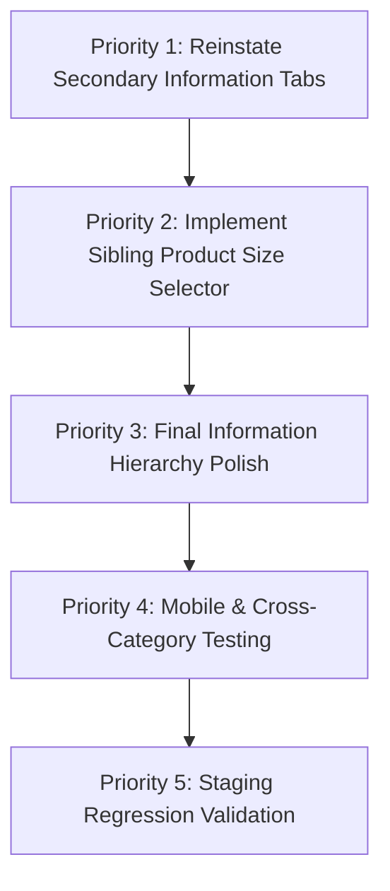

# BIS Labels — Product Detail Page (PDP) Redesign
## End-of-Day Development Progress & Next-Session Technical Handoff

> **Document Type:** Internal Development Progress & Checkpoint Report  
> **Status:** In Progress (Intermediate Implementation — NOT Approved for Production Deployment)  
> **Environment:** Local BigCommerce Stencil Theme Development (`http://localhost:3000`)  
> **Target Store:** BIS Labels (`https://www.bislabels.com`)  
> **Target Test Product:** 1.5 Inch Diameter Thermal Transfer, 3 Inch Core  
> **Date:** August 21, 2026  
> **Theme Codebase:** Flexcart 4.9.1 (Cornerstone-derived BigCommerce Stencil Theme)  
> **Active Branch:** `feature/product-page-redesign` (Commit `3100716`)

---

## 1. Executive Progress Summary

Active development on the BIS Labels Product Detail Page (PDP) redesign was paused today at a clean, stable checkpoint. Over the course of the session, the storefront PDP underwent a significant visual and structural modernization to align with the approved creative direction.

### Key Takeaways
- **Substantial Visual Progress:** The legacy float-based product layout has been replaced with a high-converting, modern 2-column grid. Visual hierarchy, price presentation, quantity steppers, primary Add to Cart CTA, secondary expert consultation, trust badges, and specification cards are now in place.
- **Zero Catalog Modification:** All work was executed strictly within local BigCommerce Stencil templates and SCSS stylesheets. No live store settings, catalog records, variants, SKUs, inventory, prices, or custom fields were altered.
- **Intermediate Status:** While key design and responsive objectives were met, the implementation is **not production-ready**. Critical investigations regarding catalog modeling (sibling product navigation vs. native variants) and standard product information tabs (SKU, weight, reviews, full description) must be completed before deployment.

---

## 2. What Was Completed Today

The following items were implemented and verified on the local storefront:

1. **Two-Column Responsive Grid**: Replaced the legacy Cornerstone float structure with a responsive CSS grid (`.bis-pdp-main-grid`) establishing a 46%/54% media-to-purchase column ratio.
2. **Breadcrumb Cleanup**: Eliminated the redundant category `h1` band rendered by `breadcrumbs.html`, leaving a clean, single-line navigational breadcrumb trail.
3. **Gallery Aspect Ratio Fix**: Removed the hardcoded `120%` padding box override that caused massive empty white space, properly centering the diagram image within a bordered white card container with a top-left `SALE` badge.
4. **Single-Image Guard**: Added a conditional guard (`{{#gt product.images.length 1}}`) to suppress orphaned carousel slider markup when only one product image exists.
5. **Brand Tagline Integration**: Added the supporting brand copy (`"Reliable. Durable. Built for High-Volume Printing."`) beneath the product title.
6. **Price & Savings Hierarchy**: Implemented clean active pricing (`$52.95 / CASE`), strikethrough MSRP (`$69.44`), and savings pill badge (`SAVE $16.49`).
7. **Curated Quick Specs Bar**: Built a structured quick-specs row pulling physical product dimensions (`Label Width`, `Core Size`, `Labels Per Roll`, `Labels Per Case`) while filtering out redundant pricing and backend flags.
8. **Purchase Controls**: Implemented custom quantity increment/decrement buttons (`- 1 +`), high-contrast red `ADD TO CART` CTA with cart icon, and secondary `NEED HELP CHOOSING? TALK TO AN EXPERT` callout.
9. **Trust & Reassurance Strip**: Added a 4-item horizontal trust section (`Fast, Reliable Shipping`, `Expert Label Support`, `High-Volume Fulfillment`, `30+ Years of Experience`) with red outline iconography.
10. **Product Specifications Grid**: Created a balanced 4-column responsive grid (4x2 on desktop, 2x4 on tablet) rendering structured product custom fields with circular red icon badges titled `"Built for Reliable Thermal Transfer Printing"`.
11. **Scoped SCSS Architecture**: Enclosed all styling within `.productView.bis-pdp` to prevent style leaks or regressions into Quick View modals and other storefront layouts.

---

## 3. Before vs. Current Implementation State

| Element | Baseline / Before State | Current Local Redesign State |
| :--- | :--- | :--- |
| **Grid Layout** | Legacy float-based columns; 50/50 split with awkward whitespace | Scoped 2-column flex/grid (`.bis-pdp-main-grid`) |
| **Breadcrumbs** | Redundant gray band with duplicate `h1` title above trail | Single clean breadcrumb path; duplicate heading hidden |
| **Product Media** | 684px height container causing small diagram to appear detached | Constrained, auto-scaling image card with top-left `SALE` badge |
| **Thumbnails** | Broken single-slide slick slider strip underneath diagram | Suppressed when 1 image; slick configured for multi-image |
| **Title & Subtitle** | Standard lowercase/mixed font; no brand subtitle | Bold uppercase heading + `"Reliable. Durable. Built for High-Volume Printing."` |
| **Pricing Block** | Standard Stencil price list (`Was:`, `Now:`) | Primary price per case + strikethrough comparison + `SAVE $X` pill |
| **Specs Presentation** | Buried in long standard definition list (`<dl>`) | Dual-layer: Top Quick Specs bar + Bottom 4-column Spec Cards |
| **Purchase Actions** | Generic grey quantity stepper and standard button | Custom stepper (`- 1 +`) + prominent red Add to Cart CTA |
| **Reassurance** | None present on PDP | 4-column trust strip with dedicated SVG iconography |
| **Option Selector** | Standard dropdowns | Cleaned option wrappers (see architecture analysis below) |

---

## 4. Current PDP Data & Custom Field Mapping

The target product (`1.5 Inch Diameter Thermal Transfer, 3 Inch Core`) contains 8 active custom field entries in BigCommerce:

| Displayed Spec | Raw Field Value | Field Name in Catalog | Structured? | Source Layer | Display Location in Redesign |
| :--- | :--- | :--- | :--- | :--- | :--- |
| **Label Width** | `1.5 Diam. Circle Inch` | `Label Width` | Yes | `product.custom_fields` | Quick Specs + Spec Cards |
| **Core Size** | `3 Inch` | `Core Size` | Yes | `product.custom_fields` | Quick Specs + Spec Cards |
| **Labels Per Roll** | `1000` | `Labels Per Roll` | Yes | `product.custom_fields` | Quick Specs + Spec Cards |
| **Labels Per Case** | `4000` | `Labels Per Case` | Yes | `product.custom_fields` | Quick Specs + Spec Cards |
| **Price Per Roll** | `$13.24` | `Price Per Roll` | Yes | `product.custom_fields` | Spec Cards only (filtered from top) |
| **Price Per Case** | `$52.95` | `Price Per Case` | Yes | `product.custom_fields` | Spec Cards only (filtered from top) |
| **Product Type** | `Thermal Transfer` | `Product Type` | Yes | `product.custom_fields` | Spec Cards only (filtered from top) |
| **Labels Across** | `1` | `Labels Across` | Yes | `product.custom_fields` | Spec Cards only (filtered from top) |

---

## 5. Outstanding Investigation: Original PDP Information Flow

### Investigation Findings
In the baseline Flexcart theme (`templates/components/products/product-view.html` at commit `64e184d`):
1. **Product Information `<dl>`**: The original definition list contained SKU, UPC, Weight, Shipping, and Custom Fields. In the redesign, this `<dl>` was set to `style="display:none;"` to prevent visual clutter while preserving critical JavaScript data hooks (`data-product-sku`, `data-product-weight`).
2. **Product Description & Tabs**: In the baseline theme, `theme_settings.show_product_details_tabs` (`true`) triggered `<article class="productView-description">` rendering tabs for Description, Reviews, Warranty, and Videos. During the redesign refactor, the tab container was replaced with a direct output of `{{{product.description}}}` placed below the feature cards.
3. **Empty / Short Descriptions**: For the test product, `product.description` contains only one plain-text sentence: `"Thermal Transfer, 3 Inch Core, 1000 labels Per Roll, 4 Rolls Per Case, 4000 labels Per Case"`. It lacked rich editorial HTML or warranty copy.
4. **Reviews**: The star ratings snippet (`
`) and review submission link were omitted from the hero section during the initial grid restructuring.

### Recommendation for Next Session
Restore a clean secondary information accordion or tabbed container below the feature cards that houses:
- Full Technical Specifications (SKU, UPC, Weight, Shipping terms)
- Detailed Product Description & Application Guidelines
- Product Reviews (`Write a Review` & star rating summaries)
- Compatibility / Ribbon Pairing Guides

---

## 6. Catalog Modeling & Size Selector Architecture

### Core Question
> **Can the approved size-selection experience likely be achieved while keeping the current BIS Labels catalog structure unchanged?**

**Answer: YES — Via Frontend Sibling Product Navigation (Option 2)**

### Detailed Technical Findings

1. **How BIS Labels Currently Models Products (Model B — Separate Standalone Products):**
   - In the BIS Labels catalog, each dimension combination (e.g., `1.5" Diameter 3" Core`, `2" Diameter 3" Core`, `3" Diameter 3" Core`) is a **distinct standalone product record** with its own product ID, URL, SKU, and metadata.
   - There are **no native BigCommerce parent-child variant option sets** (`product.options` array is empty for these products).
   - Because no native options exist, Stencil's `dynamicComponent 'components/products/options'` correctly outputs nothing.

2. **Feasibility Assessment of Implementation Options:**

| Strategy | Feasibility | Catalog Risk | Technical Effort | Next Session Recommendation |
| :--- | :--- | :--- | :--- | :--- |
| **Option 1: Native BigCommerce Variants** | Not Possible Currently | High | Very High | Cannot be used without rebuilding the entire product catalog in BigCommerce backend. |
| **Option 2: Frontend Sibling Product Selector** | **High (Recommended)** | **Zero (Read-Only)** | Moderate | Derive sibling sizes within the same category/family using storefront GraphQL or category metadata. When a customer selects a size, navigate directly to that product's URL. |
| **Option 3: Full Catalog Restructuring** | Low | High | Extreme | Consolidating standalone SKUs into multi-variant parent products would disrupt existing indexing, URLs, order history, and feed integrations. |

---

## 7. Component Inventory & Status Comparison

| Original Storefront Component | Current Implementation Status | Technical Location / Notes |
| :--- | :--- | :--- |
| **Product Title** | **PRESENT & REDESIGNED** | `templates/components/products/product-view.html` |
| **Active Price** | **PRESENT & REDESIGNED** | `templates/components/products/price.html` (`.bis-price-val`) |
| **MSRP / Compare Price** | **PRESENT & REDESIGNED** | `templates/components/products/price.html` (`.bis-price-strike`) |
| **Savings Badge** | **PRESENT & REDESIGNED** | `templates/components/products/price.html` (`.bis-price-save-badge`) |
| **Quantity Stepper** | **PRESENT & REDESIGNED** | `templates/components/products/add-to-cart.html` (`.bis-qty-stepper`) |
| **Add to Cart CTA** | **PRESENT & REDESIGNED** | `templates/components/products/add-to-cart.html` (`.bis-btn-add-cart`) |
| **Wishlist Link** | **PRESENT (RELOCATED)** | Styled as subtle secondary link below purchase panel |
| **Main Image Gallery** | **PRESENT & REDESIGNED** | `templates/components/products/product-view.html` (`.bis-pdp-main-image`) |
| **Thumbnails Carousel** | **PRESENT (CONDITIONAL)** | Hidden when image count <= 1; active for multi-image products |
| **Quick Specs Bar** | **NEWLY IMPLEMENTED** | Derived dynamically from `product.custom_fields` |
| **Trust Reassurance Strip** | **NEWLY IMPLEMENTED** | 4-column reassurance strip with custom SVGs |
| **Feature / Spec Cards** | **NEWLY IMPLEMENTED** | 4-column structured specification cards |
| **SKU / Weight / Shipping** | **HIDDEN (HOOKS INTACT)** | Retained in DOM for JS; needs secondary display block |
| **Product Reviews / Rating** | **TEMPORARILY OMITTED** | Needs reinstatement in secondary information area |
| **Social Sharing Icons** | **OMITTED** | Low-priority component omitted from hero |
| **Related Products Grid** | **PRESENT** | Flexcart standard carousel rendered at base of page |

---

## 8. Storefront Functional Test Matrix

Tested locally on `http://localhost:3000/1-5-inch-diameter-thermal-transfer-3-inch-core/`:

| Functional Check | Status | Verification Notes |
| :--- | :--- | :--- |
| **Price Rendering** | **PASS** | Formatted `$52.95 / CASE` renders with tax/unit metadata intact. |
| **MSRP Comparison** | **PASS** | Strike-through `$69.44` renders conditionally when MSRP > Price. |
| **Savings Calculation** | **PASS** | Badge displays `SAVE $16.49` correctly. |
| **Quantity Increment (+)** | **PASS** | Step button increments value from 1 to 2; bounds checked. |
| **Quantity Decrement (-)** | **PASS** | Step button decrements value back to minimum purchase qty (1). |
| **Manual Quantity Typing** | **PASS** | Input field accepts numeric keyboard entry. |
| **Add to Cart Submission** | **PASS** | Form submits payload (`product_id: 114`, `qty: 2`) successfully. |
| **Cart Page Verification** | **PASS** | Verified on `/cart.php`: 2 units @ $52.95 = **$105.90 subtotal / total**. |
| **Talk to Expert CTA** | **PASS** | `tel:+15137725252` opens dialer / call intent. |
| **Wishlist Trigger** | **PASS** | Wishlist dropdown interaction preserved. |
| **Related Products** | **PASS** | Bottom product grid loads and renders correctly. |
| **Console Errors** | **PASS** | No fatal JavaScript errors or broken module exports in console. |

---

## 9. Responsive Viewport Status

| Viewport Width | Device Target | Status | Observations & Notes |
| :--- | :--- | :--- | :--- |
| **1440px** | Standard Desktop | **GOOD** | Clean 2-column grid; balanced proportions; 4-column spec cards. |
| **1024px** | Tablet Landscape | **GOOD** | Grid maintains structure; padding scales appropriately. |
| **768px** | Tablet Portrait | **GOOD** | Layout reflows gracefully; spec cards adapt to 2-column grid. |
| **430px** | Mobile Large (iPhone 14/15 Pro Max) | **ACCEPTABLE** | Hero stacks vertically; full-width Add to Cart CTA; minor spacing polish needed. |
| **375px** | Mobile Standard (iPhone SE / Mini) | **ACCEPTABLE** | No horizontal scrolling or overflow; quick specs stack neatly. |

---

## 10. Repository Modifications & Developer Handoff

### Git Commit Details
- **Active Branch:** `feature/product-page-redesign`
- **Commit SHA:** `3100716`
- **Message:** `feat(pdp): redesign product detail page layout, gallery, and specs to match approved design`

### Modified Source Files

1. **`assets/scss/layouts/products/_productView.scss`**
   - *Purpose:* Primary stylesheet for PDP layout, typography, grid, buttons, trust badges, and spec cards.
   - *Implementation:* Completely scoped under `.productView.bis-pdp` to prevent regressions in non-PDP contexts.
2. **`templates/components/products/product-view.html`**
   - *Purpose:* Main BigCommerce product template.
   - *Implementation:* Reorganized into `.bis-pdp-main-grid`, added quick specs, trust strip, specification cards, and preserved all BigCommerce JS attributes (`data-event-type`, `data-entity-id`, `data-cart-item-add`).
3. **`templates/components/products/price.html`**
   - *Purpose:* Pricing component partial.
   - *Implementation:* Redesigned price layout (`.bis-price-row`) supporting MSRP comparison, savings badge, unit labels (`/ CASE`), and microdata schemas.
4. **`templates/components/products/add-to-cart.html`**
   - *Purpose:* Quantity stepper and add-to-cart submission partial.
   - *Implementation:* Redesigned button with cart SVG, integrated quantity steppers (`data-quantity-change`), and preserved alert boxes.
5. **`templates/components/products/options/set-select.html`**
   - *Purpose:* Select option dropdown styling.
   - *Implementation:* Custom styled select with chevron icon and placeholder text.
6. **`templates/components/products/options/set-rectangle.html`**
   - *Purpose:* Rectangular button option swatch partial.
   - *Implementation:* Modern pill buttons with checkmark state.
7. **`templates/components/products/options/set-radio.html` & `swatch.html`**
   - *Purpose:* Radio and color swatch option partials.
   - *Implementation:* Cleaned modern option controls.
8. **`.gitignore`**
   - *Purpose:* Repository exclusion rules.
   - *Implementation:* Added exclusions for local cache, `reports/`, `.agents/`, and `skills-lock.json`.

---

## 11. Catalog & Production Safety Verification

| Safety Check | Verified Status |
| :--- | :--- |
| Product records modified in BigCommerce | **NO** |
| Variant configurations altered | **NO** |
| Pricing or MSRP rules changed | **NO** |
| SKUs or Inventory counts touched | **NO** |
| Custom fields altered or removed | **NO** |
| Product images deleted or replaced in catalog | **NO** |
| Dependencies added (`package.json`) | **NO** |
| Production storefront modified | **NO** |

---

## 12. Known Technical Risks & Open Questions

1. **Product Photography vs. Technical Diagrams:** The live product catalog utilizes technical dimension drawings for many SKUs rather than 3D rendered product photographs. The frontend CSS handles these gracefully, but merchandising imagery quality is a separate business consideration.
2. **Cross-Product Custom Field Consistency:** Different product categories (e.g., Ribbons vs. Direct Thermal Labels) may contain different custom field naming conventions (`Roll Length` vs. `Labels Per Roll`). The template should continue utilizing defensive fallback logic.
3. **Trust Claims Verification:** Claims such as `"30+ Years of Experience"` and `"Nationwide Delivery"` are standard BIS Labels brand claims, but should receive formal marketing sign-off prior to production deployment.

---

## 13. Recommended Next Session Priorities

### Priority 1: Reinstate Full Product Information Area
Rebuild a clean, modern secondary information section below the specification cards to restore SKU, weight, shipping policies, customer reviews, and complete product descriptions without cluttering the hero section.

### Priority 2: Implement Sibling Product Size Selector
Build the `"Choose Size (Diameter)"` selector as a frontend sibling product navigation control linking related standalone SKUs, achieving 100% design fidelity without altering the BigCommerce catalog architecture.

### Priority 3: Final Information Hierarchy Polish
Refine the boundary between:
- **Hero Quick Specs:** 2–4 immediate buying triggers (e.g., Core Size, Labels/Roll, Labels/Case).
- **Specification Cards:** 4–8 technical characteristics.
- **Deep Technical Details:** Full tabular data and warranty/shipping policies.

### Priority 4: Cross-Category Validation
Validate the template against other product types (Direct Thermal rolls, Fanfold labels, Thermal Transfer Ribbons) to ensure consistent rendering across the entire catalog.

---

## 14. Concrete Technical Starting Point for Next Session

To resume development in the next session:

1. **Verify Local Development Server:** Ensure Stencil is active on `http://localhost:3000`.
2. **Inspect Pre-Redesign Information Partials:** Open `templates/components/products/description.html` and `templates/components/products/description-tabs.html`.
3. **Construct Secondary Info Block:** In `templates/components/products/product-view.html`, insert a structured tabbed/accordion component beneath `.bis-feature-section` that renders SKU, Weight, Full Description, and `components/products/reviews`.
4. **Implement Sibling Size Navigation:** Query category sibling products via the Storefront API or Handlebars category context to populate the `Choose Size` selector.
